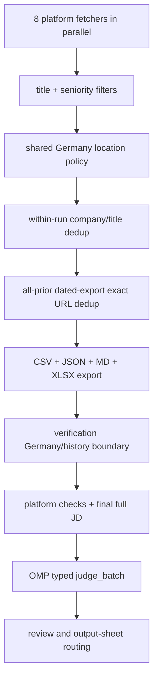

# Architecture

Technical details for the Jobscraper pipeline and verification post-step.

## Pipeline Flow

The scraper and ATS fetchers use one conservative Germany policy. Verification
repeats the location and working-student checks before any output-sheet routing.
Exact URLs seen in earlier dated exports are filtered before verification
requests or JD judgment. Same-day scrape reruns preserve only eligible existing
rows that are not already present in earlier history.

All 8 platform fetchers run simultaneously via `ThreadPoolExecutor(max_workers=8)`.
Each fetcher is independent; results are collected after all complete.

## Filter Chain

Every scraped job passes through `check_experience_and_location()`; ATS results
use the same location helpers:

1. **Title relevance** (`is_relevant_title`) — rejects titles with no
   data/analytics/AI/SQL/Python keyword.
2. **Seniority ceiling** — rejects senior, lead, principal, staff, manager,
   head, architect, and director titles. Required experience years are judged
   from the full description during verification.
3. **Germany location evidence** — requires Germany/Deutschland, a structured
   `DE` country segment, a German state, or an unambiguous German city. Unknown,
   blank, and remote-region-only locations are not treated as Germany.
4. **Working-student city restriction** — Working Student roles require
   Hamburg or Kiel; other eligible role types may be Germany-wide.

`verify_jobs.py` enforces the same location policy at the start of verification,
so foreign/unknown rows from older inputs never appear in any output sheet.

## Freshness Filtering (24h, all 8 platforms)

| Platform | Server-side filter | Post-filter | No-date behavior |
|---|---|---|---|
| Arbeitnow | — | `created_at` vs 24h cutoff | N/A (API always has timestamp) |
| Xing | — | `<time dateTime>` vs cutoff | Include (sponsored listings are real jobs) |
| Stepstone | `ag=age_1` (24h) | `parse_stepstone_timeago()` vs cutoff | Include (defaults to now) |
| LinkedIn | `f_TPR=r86400` (24h) | `posted_at` datetime vs cutoff | Include (safety net only) |
| Indeed | GraphQL `dateOnIndeed` with `start: "24h"` | `dateOnIndeed` or `datePublished` vs cutoff | Include when no timestamp is available |
| Wellfound | — | `_parse_wellfound_date()` relative date vs cutoff | Include (no date = "Last 24h") |
| EU Remote Jobs | `after` param (ISO datetime) | `date` field vs cutoff | N/A (API always has timestamp) |
| ATS: Greenhouse | — | `first_published` vs cutoff | Include (via `_is_fresh`) |
| ATS: SmartRecruiters | — | `releasedDate` vs cutoff | Include (via `_is_fresh`) |
| ATS: Ashby | — | `publishedDate` vs cutoff | Include (via `_is_fresh`) |

## Deduplication

| Scope | Stage | Method | Behavior |
|---|---|---|---|
| Within-run | Before export | `normalize_key()` on company + title | Removes same-run name/title variants |
| Cross-run | Before export and verification | `load_seen_job_urls()` + `normalize_job_url()` | Exact stable posting URL identity across every earlier dated export; no cross-date title/company matching |

`normalize_job_url()` canonicalizes LinkedIn numeric job IDs and Indeed `jk`
IDs, normalizes scheme/host, removes recognized tracking keys, and preserves
case-sensitive generic paths and unrecognized query parameters in deterministic
order. History scans exclude current/future dates and fail visibly on unreadable
exports. The current-date export is preserved on same-day reruns after the
same Germany and historical-URL checks. Historical outputs are never rewritten.

## Verification Post-Step

### Eligibility, acquisition, and typed judgment

`run_verification()` first filters foreign/unknown locations and working-student
roles outside Hamburg/Kiel. Germany-eligible rows whose exact URL appears in
an earlier dated export are sent to **Previously Seen** without platform
requests or JD judgment. Only remaining rows proceed.

The verifier injects descriptions from the sibling JSON, checks platform
status, then merges any longer description acquired during verification. The
judge receives the final full description; it does not use regex-selected or
truncated excerpts.

The verification entry point is async and requires OMP eval's `judge_batch`.
It submits independent typed choices for German requirement and required
experience in one bounded-concurrency batch:

- German: required C1/C2, fluent/fließend, native/Muttersprache,
  verhandlungssicher, or standalone *sehr gute Deutschkenntnisse* maps to
  `German C1+ required`; B1/B2 is allowed; preferred German maps to
  `German preferred`. *Sehr gute Deutsch- und Englischkenntnisse* stays in the
  allowed B1/B2 category unless C1+ is explicit.
- Experience: use the lower bound of required ranges (0–2 → minimum 0,
  1–3 → minimum 1, 3–5 → minimum 3); optional/preferred years do not
  disqualify. Required *mehrjährige Erfahrung* / several years is >2.
- Missing/insufficient descriptions, failed judgments, and invalid typed
  answers are marked **Needs Review**; no permissive defaults can qualify a row.

### Routing and verified workbook

After Germany/history and incomplete-review boundaries, rows route to Already
Applied, Reposted, closed/C1+/experience exclusions, Staffing Companies, or To
Apply. To Apply always exists; other sheets are created when they contain rows:
Reposted, Staffing Companies, Already Applied, Needs Review, Previously Seen.
The workbook keeps the `detail_language`, `detail_exp_years`,
`detail_review_status`, `detail_reposted`, `detail_salary`, and `detail_remote`
columns. Structural hyperlinks are checked on every sheet; HTTP sampling skips
Previously Seen URLs.

### Reposted LinkedIn Detection

Existing repost heuristics route surviving LinkedIn rows to Reposted; they do
not override the all-history exact-URL filter. Exact historical URLs cannot be
reintroduced into To Apply by carryover/repost handling.

## Target Role Profiles

| # | Role | Covers variants |
|---|---|---|
| 1 | Data Engineer | Junior, Cloud, Data Warehouse, ETL, Dateningenieur |
| 2 | Analytics Engineer | — |
| 3 | Data Analyst | Datenanalyst, BI Developer, BI Entwickler |
| 4 | AI Engineer | AI Data Engineer, GenAI, Junior Data Scientist |
| 5 | Machine Learning Engineer | — |
| 6 | Business Analyst | — |
| 7 | SQL Developer | Database Developer, Python Data Developer |
| 8 | Praktikum Data | Internship Data |
| 9 | Werkstudent Data | Working Student Data |
| 10 | Werkstudent Business Intelligence | Working Student BI |

## Function Reference

### Pipeline (`apify_job_search.py`)

| Function | Purpose |
|---|---|
| `fetch_arbeitnow_jobs()` | Free REST API, filters by `created_at` |
| `fetch_xing_jobs()` | Free `requests` HTML scraper |
| `fetch_stepstone_jobs()` | Free `requests` HTML scraper |
| `fetch_linkedin_jobs_free()` | Free HTML scraping, multi-city, 10 roles parallel, retry on 429 |
| `fetch_indeed_jobs()` | GraphQL API, 10 roles parallel, full descriptions |
| `fetch_wellfound_jobs()` | SSR role pages and JSON-LD description enrichment |
| `fetch_euremotejobs_jobs()` | WordPress REST API with full descriptions |
| `fetch_all_ats()` | Orchestrator for Greenhouse/SmartRecruiters/Ashby |
| `check_experience_and_location()` | Title/seniority filters plus shared Germany and working-student location policy |
| `normalize_key()` | Within-run company/title dedup key |
| `load_current_run_jobs()` | Reads today's export for safe same-day preservation |
| `main()` | Scrapes, applies all-prior exact URL dedup and location guard, then exports |
| `convert_csv_to_xlsx()` | openpyxl export with clickable links and autofilter |

### Shared identity and location (`job_identity.py`, `location_policy.py`)

| Function | Purpose |
|---|---|
| `normalize_job_url()` | Stable URL identity; LinkedIn numeric IDs and Indeed `jk` canonicalized; known tracking removed; generic path/query identity preserved |
| `load_seen_job_urls()` | Exact URL set from every earlier dated export; raises on unreadable history |
| `is_germany_location()` | Conservative Germany country/state/city evidence |
| `is_hamburg_or_kiel()` | Exact Hamburg/Kiel token check for working-student eligibility |

### ATS (`ats_scraper.py`)

| Function | Purpose |
|---|---|
| `fetch_greenhouse()` | Greenhouse public JSON API, `first_published` freshness |
| `fetch_smartrecruiters()` | SmartRecruiters public JSON API, paginated, `releasedDate` |
| `fetch_ashby()` | Ashby embedded `window.__appData` JSON, `publishedDate` |
| `_is_fresh()` | Freshness check — returns True when date is None (false positives > false negatives) |

### Verification (`verify_jobs.py`)

| Function | Purpose |
|---|---|
| `run_verification()` | Async entry: Germany/history prefilter, platform checks, final JD judgment, routing, workbook export |
| `llm_classify_all()` | One bounded OMP `judge_batch` call on full final descriptions; missing/failing rows become Needs Review |
| `apply_judgment_answers()` | Validates typed choices and preserves exact experience buckets |
| `verify_linkedin()` | LinkedIn liveness and JSON-LD description handling |
| `verify_indeed()` | Indeed GraphQL API verification |
| `verify_xing()` / `verify_stepstone()` | Platform-specific verification |
| `detect_reposted()` | Existing LinkedIn repost routing; cannot bypass the all-history exact-URL filter |
| `save_xlsx()` | To Apply plus conditional Reposted, Staffing Companies, Already Applied, Needs Review, and Previously Seen sheets |
| `smoke_test_hyperlinks()` | Structural checks on all sheets; HTTP sampling excludes Previously Seen |

### Staffing Filter (`staffing_filter.py`)

| Function | Purpose |
|---|---|
| `is_staffing_company()` | Checks company names against the shared staffing/recruitment blocklist |

### Already-Applied Detection (`applied_check.py`)

| Function | Purpose |
|---|---|
| `load_applied_data()` | Reads the applications tracker and builds deterministic company/title and URL keys |
| `prepare_match_input(csv_path)` | Pre-filters scraped/tracker pairs and writes `/tmp/already_applied_input.json` for JS-side matching |
| `load_llm_matches()` | Loads JS-classified tracker matches from `/tmp/already_applied_matches.json` |
| `is_already_applied()` | Checks LLM match sets first, then deterministic URL/key fallback |
