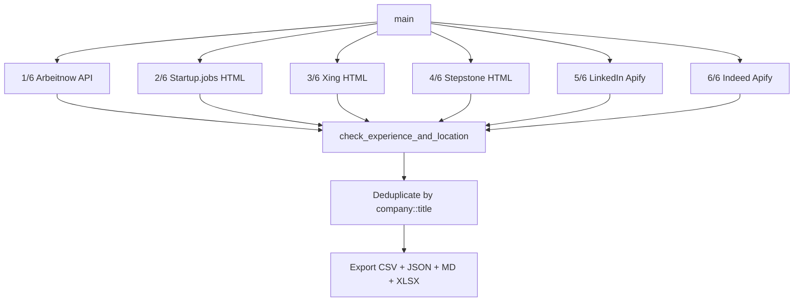

# Jobscraper

Automated job search pipeline that fetches fresh postings (< 24 hours old) from six platforms, filters them for entry-level data/analytics/AI roles in Germany, and exports a sortable CSV/XLSX/JSON/MD report.

## Quick Start

```bash
cd /home/sagar/Skills/Jobscraper
pip install cloudscraper openpyxl
python3 apify_job_search.py
```

Output is written to `Job Search/YYYY-MM-DD/`.

## What It Does

The pipeline runs six platform fetchers in sequence, applies a multi-stage filter chain, deduplicates, and exports four deliverable files:

```
6 platforms → title relevance → seniority/experience → Germany location → working-student city → dedup → export
```

### Platforms

| Platform | Source | Cost/run | Method |
|---|---|---|---|
| LinkedIn | Apify: `curious_coder/linkedin-jobs-scraper` | ~$0.50 | Apify actor, `count=500`, 10 role URLs, `f_TPR=r86400` (24h filter) |
| Indeed | Apify: `valig/indeed-jobs-scraper` | ~$0.05 | Apify actor, `limit=50` per role, 10 roles in parallel |
| Arbeitnow | Free REST API | $0.00 | `https://www.arbeitnow.com/api/job-board-api` |
| Startup.jobs | Free HTML scraping | $0.00 | `cloudscraper`, 6 category pages |
| Xing | Free HTML scraping | $0.00 | `cloudscraper`, 10 roles × 3 pages, `data-testid` attributes |
| Stepstone | Free HTML scraping | $0.00 | `cloudscraper`, 10 roles × 3 pages, path-based URLs with `ag=age_1` 24h filter |
| **Total** | | **~$0.55** | |

### Filter Chain

Every job passes through `check_experience_and_location()` which applies, in order:

1. **Title relevance** (`is_relevant_title`) — rejects titles with no data/analytics/AI/SQL/Python keyword. Catches actor false positives (Indeed returning "Nachtwächter" for "Data Engineer" searches).
2. **Seniority ceiling** — rejects Senior, Lead, Principal, Staff, Manager, Head, Architect, Director titles and descriptions requiring > 2 years experience.
3. **Germany location guard** — rejects jobs whose location explicitly names a non-Germany country (30 countries in EN/DE). Added 2026-08-07 after LinkedIn AI search softened `location=Germany` into a natural-language hint. Ambiguous locations (city-only, "Remote") pass through.
4. **Working-student city restriction** — working student roles restricted to Hamburg and Kiel only. Full-time and internships are Germany-wide.

### Target Role Profiles (10 core roles)

| # | Role | Covers variants |
|---|---|---|
| 1 | Data Engineer | Junior, Cloud, Data Warehouse, ETL, Dateningenieur |
| 2 | Analytics Engineer | — |
| 3 | Data Analyst | Datenanalyst, BI Developer, BI Entwickler |
| 4 | AI Engineer | AI Data Engineer, GenAI, Junior Data Scientist |
| 5 | Machine Learning Engineer | — |
| 6 | Business Analyst | — |
| 7 | SQL Developer | Database Developer, Python Data Developer |
| 8 | Praktikum Data | Internship Data |
| 9 | Werkstudent Data | Working Student Data |
| 10 | Werkstudent Business Intelligence | Working Student BI |

## Output

Files written to `Job Search/YYYY-MM-DD/` per run:

| File | Description |
|---|---|
| `Job_Search_<Month>_<Day>_<Year>.csv` | UTF-8 BOM, sortable in Excel/Calc |
| `Job_Search_<Month>_<Day>_<Year>.json` | Same data in JSON |
| `Job_Search_<Month>_<Day>_<Year>.xlsx` | Frozen header, autofilter dropdowns, clickable `job_url` hyperlinks, numeric `match_score` |
| `JOB_OPENINGS_LAST_24H.md` | Markdown summary table with apply links |

**CSV columns:** `language`, `job_board`, `role_type`, `title`, `company`, `location`, `posted_at`, `exp_required`, `match_score`, `job_url`

## Configuration

### Apify Token

Read from (in order of precedence):
1. `APIFY_TOKEN` environment variable
2. `config.json` in the skill root (`{"APIFY_TOKEN": "..."}`)
3. `~/.apify/auth.json` (Apify CLI auth)

### Dependencies

- Python >= 3.10
- `cloudscraper` — bypasses Cloudflare/anti-bot for Startup.jobs, Xing, Stepstone
- `openpyxl` — XLSX export with autofilter and hyperlinks

```bash
pip install cloudscraper openpyxl
```

## Project Structure

```
Jobscraper/
├── README.md                # this file
├── CHANGELOG.md             # version history
├── SKILL.md                 # OMP skill definition (trigger keywords, execution instructions)
├── apify_job_search.py      # main pipeline script (~980 lines, self-contained)
├── apify_job_search.md      # detailed technical documentation (actor schemas, gotchas, cost analysis)
├── config.json              # Apify token (gitignored)
├── .gitignore
└── Job Search/              # output directory (gitignored, one subfolder per run date)
    ├── 2026-08-06/
    ├── 2026-08-05/
    └── 2026-08-04/
```

## How It Works

### Pipeline Flow



### Key Functions

| Function | Purpose |
|---|---|
| `fetch_arbeitnow_jobs()` | Free REST API, filters by `created_at` timestamp |
| `fetch_startupjobs_jobs()` | `cloudscraper` HTML parse, `data-post-template-target` attributes |
| `fetch_xing_jobs()` | `cloudscraper` HTML parse, `data-testid` attributes, `<time dateTime>` ISO timestamps |
| `fetch_stepstone_jobs()` | `cloudscraper` HTML parse, `data-at` SSR attributes, German relative time parsing |
| `fetch_linkedin_jobs()` | Apify actor, 10 role URLs with `f_TPR=r86400` 24h filter |
| `fetch_indeed_jobs()` | Apify actor, 10 roles in parallel via `ThreadPoolExecutor` |
| `run_apify_actor()` | Starts actor, polls status, fetches dataset, `maxTotalChargeUsd` safety cap |
| `check_experience_and_location()` | Multi-stage filter: title relevance → seniority → Germany → city |
| `is_relevant_title()` | Regex check for data/analytics/AI keywords in title |
| `classify_role_type()` | Working Student / Internship / Full-Time classification |
| `compute_match_score()` | Percentage match against core tech stack (dbt, airflow, spark, python, sql, etc.) |
| `normalize_key()` | Dedup key: `company::title` with legal suffixes stripped |
| `convert_csv_to_xlsx()` | openpyxl export with autofilter, frozen header, hyperlinks |

## Customization

This pipeline is configured for a specific candidate profile. To adapt it for another user, modify the following in **`SKILL.md`** and **`apify_job_search.py`**:

### Role Types & Location Constraints (`SKILL.md` → Search Criteria §4)

| Setting | Current value | Where to change |
|---|---|---|
| Full-Time / Part-Time / Entry-Level / Junior | Germany-wide | `SKILL.md` §4, `apify_job_search.py` → `check_experience_and_location()` |
| Internships (Praktikum / Internship) | Germany-wide | `SKILL.md` §4, `apify_job_search.py` → `check_experience_and_location()` |
| Working Student (Werkstudent / Working Student) | **Hamburg and Kiel only** | `SKILL.md` §4, `apify_job_search.py` → `check_experience_and_location()` §2b |

### Experience Ceiling (`SKILL.md` → Search Criteria §5)

Currently set to **<= 2 years**. Rejects Senior, Lead, Principal, Staff, Manager, Head, Architect, Director titles.

To change this, edit in `apify_job_search.py`:
- `MAX_EXP_YEARS` constant (line 70)
- `EXCLUDED_TITLE_PATTERNS` regex (line 98) — the seniority title blacklist
- `EXCLUDED_EXP_PATTERNS` regex list (line 103) — the description experience pattern matchers

### Target Role Profiles (`SKILL.md` → Search Criteria §6)

Currently 10 core roles. To change which roles are searched, edit the `SEARCH_ROLES` list in `apify_job_search.py` (line 51):

```python
SEARCH_ROLES = [
    "Data Engineer",
    "Analytics Engineer",
    "Data Analyst",
    "AI Engineer",
    "Machine Learning Engineer",
    "Business Analyst",
    "SQL Developer",
    "Praktikum Data",
    "Werkstudent Data",
    "Werkstudent Business Intelligence",
]
```

Also update the matching `SKILL.md` §6 list so the skill documentation stays in sync.

### Other User-Specific Settings

| Setting | Where | Current value |
|---|---|---|
| Candidate name | `SKILL.md` → Context, `apify_job_search.md` §1 | Sagar Marthandan |
| Base location | `SKILL.md` → Context, `apify_job_search.md` §1 | Kiel, Germany |
| Working student cities | `apify_job_search.py` → `check_experience_and_location()` §2b | Hamburg, Kiel |
| Match score tech stack | `apify_job_search.py` → `TECH_KEYWORDS` (line 111) | dbt, airflow, spark, pyspark, python, sql, gcp, bigquery, aws, azure, databricks, docker, kafka, postgresql, snowflake |
| Title relevance keywords | `apify_job_search.py` → `DOMAIN_TITLE_KEYWORDS` (line 116) | data, analytics, AI, SQL, Python, BI, ML, ETL, etc. |
| Output directory | `apify_job_search.py` → `JOB_SEARCH_DIR` (line 42) | `/home/sagar/Skills/Jobscraper/Job Search` |
| Apify token | `config.json` or `APIFY_TOKEN` env var | user-specific |

## Detailed Documentation

For actor input schemas, platform-specific gotchas, cost optimization history, and rejected alternatives, see [`apify_job_search.md`](apify_job_search.md).

For the OMP skill trigger definition, see [`SKILL.md`](SKILL.md).

For version history, see [`CHANGELOG.md`](CHANGELOG.md).
