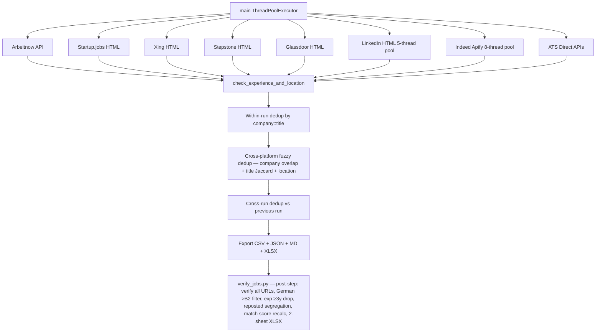

# Jobscraper

Automated job search pipeline that fetches fresh postings (< 24 hours old) from **9 sources across 8 platforms**, filters them for entry-level data/analytics/AI roles in Germany, and exports a sortable CSV/XLSX/JSON/MD report. All platforms run in **parallel** via `ThreadPoolExecutor` — total runtime ~27s (was 191s sequential).

## Quick Start

```bash
cd /home/sagar/Skills/Jobscraper
pip install cloudscraper requests openpyxl beautifulsoup4
python3 apify_job_search.py
```

Output is written to `Job Search/YYYY-MM-DD/`.

## What It Does

The pipeline launches all 8 platform fetchers simultaneously, applies a multi-stage filter chain, deduplicates within and across runs, and exports four deliverable files:

```
8 platforms in parallel → title relevance → seniority/experience → Germany location → working-student city → within-run dedup → cross-run dedup → export
```

### Platforms

| Platform | Source | Cost/run | Method |
|---|---|---|---|
| LinkedIn | Free HTML scraping | $0.00 | Public jobs search page, `f_TPR=r86400` (24h server filter) + post-filter. Multi-city search (6 locations × 10 roles). 10 roles in parallel (`ThreadPoolExecutor(max_workers=5)` + 429 retry). No descriptions — title-only filtering (more permissive). |
| Indeed | Apify: `valig/indeed-jobs-scraper` | ~$0.04 | Apify actor, `limit=50` per role, 10 roles in parallel, `datePosted='1'` (unreliable — post-filter on `datePublished` enforces 24h) |
| Arbeitnow | Free REST API | $0.00 | `https://www.arbeitnow.com/api/job-board-api`, filters by `created_at` timestamp |
| Startup.jobs | Free HTML scraping | $0.00 | `cloudscraper`, 7 category pages, `data-post-template-target` attributes |
| Xing | Free HTML scraping | $0.00 | `requests`, 10 roles × 3 pages, `data-testid` attributes (AWS CloudFront — no anti-bot). No-date jobs included (sponsored listings are real jobs). |
| Stepstone | Free HTML scraping | $0.00 | `requests`, 10 roles × 3 pages, path-based URLs with `ag=age_1` 24h server filter + `parse_stepstone_timeago()` post-filter (Akamai CDN — cloudscraper hangs, plain requests works) |
| Glassdoor | Free HTML scraping | $0.00 | `cloudscraper` (chrome emulation), 10 roles × 3 pages, JSON-LD ItemList parsing, `_KE` company extraction, `ageInDays` filtering from RSC payload. **8x retry for Cloudflare.** `fromAge=1` ignored by SSR — `ageInDays==0` is the only freshness barrier. Jobs with unverified `ageInDays` are **skipped** (Glassdoor exception — SSR serves 15-179 day-old jobs). |
| ATS Direct | Free public JSON APIs | $0.00 | Greenhouse (`boards-api.greenhouse.io`), SmartRecruiters (`api.smartrecruiters.com`), Ashby (`jobs.ashbyhq.com` embedded JSON). 17 curated German tech companies. No auth, no HTML selectors — stable documented APIs. |
| **Total** | | **~$0.04** | |

### Parallelization

All 8 platform fetchers run simultaneously via `ThreadPoolExecutor(max_workers=8)`. Each fetcher is independent — no shared mutable state, results collected after all complete. LinkedIn internally parallelizes its 10 search roles with `max_workers=5` (limited to avoid 429 rate limiting) + 3s backoff retry.

Runtime: **~27s** (was 191s sequential — 7x speedup). I/O bound work — Python releases the GIL during HTTP requests, so threads give near-linear speedup.

### Filter Chain

Every job passes through `check_experience_and_location()` which applies, in order:

1. **Title relevance** (`is_relevant_title`) — rejects titles with no data/analytics/AI/SQL/Python keyword. Catches actor false positives (Indeed returning "Nachtwächter" for "Data Engineer" searches).
2. **Seniority ceiling** — rejects Senior, Lead, Principal, Staff, Manager, Head, Architect, Director titles and descriptions requiring > 2 years experience.
3. **Germany location guard** — rejects jobs whose location explicitly names a non-Germany country (30 countries in EN/DE). Ambiguous locations (city-only, "Remote") pass through.
4. **Working-student city restriction** — working student roles restricted to Hamburg and Kiel only. Full-time and internships are Germany-wide.

### Freshness Filtering (24h, all 9 sources)

| Platform | Server-side filter | Post-filter | No-date behavior |
|---|---|---|---|
| Arbeitnow | — | `created_at` vs 24h cutoff | N/A (API always has timestamp) |
| Startup.jobs | — | `timestamp` vs cutoff | Include (false positives > false negatives) |
| Xing | — | `<time dateTime>` vs cutoff | Include (sponsored listings are real jobs) |
| Stepstone | `ag=age_1` (24h) | `parse_stepstone_timeago()` vs cutoff | Include (defaults to now) |
| Glassdoor | — | `ageInDays == 0` from RSC payload | **Skip** (Glassdoor exception — SSR serves stale jobs) |
| LinkedIn | `f_TPR=r86400` (24h) | `posted_at` datetime vs cutoff | Include (safety net only) |
| Indeed | `datePosted='1'` (unreliable) | `datePublished` vs cutoff | Include (false positives > false negatives) |
| ATS: Greenhouse | — | `first_published` vs cutoff | Include (via `_is_fresh`) |
| ATS: SmartRecruiters | — | `releasedDate` vs cutoff | Include (via `_is_fresh`) |
| ATS: Ashby | — | `publishedDate` vs cutoff | Include (via `_is_fresh`) |

**Glassdoor exception**: Glassdoor's SSR ignores the `fromAge=1` URL parameter and serves unfiltered results (0/30 fresh, 16/30 stale at 15-179 days old in live testing). The `ageInDays==0` filter from the RSC payload is the only barrier against stale jobs. Unlike other platforms where missing dates mean "include" (false positives > false negatives), Glassdoor skips jobs with unverified `ageInDays` because they come from an unfiltered result set and are more likely old than fresh.

### Target Role Profiles (10 core roles)

| # | Role | Covers variants |
|---|---|---|
| 1 | Data Engineer | Junior, Cloud, Data Warehouse, ETL, Dateningenieur |
| 2 | Analytics Engineer | — |
| 3 | Data Analyst | Datenanalyst, BI Developer, BI Entwickler |
| 4 | AI Engineer | AI Data Engineer, GenAI, Junior Data Scientist |
| 5 | Machine Learning Engineer | — |
| 6 | Business Analyst | — |
| 7 | SQL Developer | Database Developer, Python Data Developer |
| 8 | Praktikum Data | Internship Data |
| 9 | Werkstudent Data | Working Student Data |
| 10 | Werkstudent Business Intelligence | Working Student BI |

## Output

Files written to `Job Search/YYYY-MM-DD/` per run:

| File | Description |
|---|---|
| `Job_Search_<Month>_<Day>_<Year>.csv` | UTF-8 BOM, sortable in Excel/Calc |
| `Job_Search_<Month>_<Day>_<Year>.json` | Same data in JSON |
| `Job_Search_<Month>_<Day>_<Year>.xlsx` | Frozen header, autofilter dropdowns, clickable `job_url` hyperlinks, numeric `match_score` |
| `JOB_OPENINGS_LAST_24H.md` | Markdown summary table with apply links |

**CSV columns:** `language`, `job_board`, `role_type`, `title`, `company`, `location`, `posted_at`, `exp_required`, `match_score`, `job_url`

### Deduplication (Three Tiers)

The pipeline applies three dedup stages in sequence:

| Tier | Stage | Method | Catches |
|---|---|---|---|
| 1 | **Within-run** | `normalize_key()` — enhanced normalization strips parentheticals, legal suffixes (`gmbh\|ag\|group\|gruppe\|international\|deutschland\|germany\|global\|e.g.`), seniority/gender markers (`senior\|junior\|m/w/d`), and REF codes (`REF99139A`). Exact match on `company::title`. | Same posting on same platform with name/title variants |
| 2 | **Cross-platform** | `cross_platform_dedup()` — fuzzy matching across *different platforms only*. Company token overlap ≥ 0.5 (min-set denominator), title Jaccard similarity ≥ 0.6, location match (with city aliases: München/Munich, Köln/Cologne). Keeps higher-priority platform (LinkedIn > Xing > Stepstone > Indeed). | Same job reposted across LinkedIn/Xing/Stepstone/Indeed with company name variants (Bosch vs Bosch Gruppe, PENNY vs PENNY International) |
| 3 | **Cross-run** | `load_previous_run_keys()` — compares against the immediate previous run using URL keys (all history) + title keys (previous run only). | Consecutive-day duplicates from 24h window overlap, LinkedIn re-lists (new URL per run, same job) |

Same-day reruns are handled automatically (today's own earlier CSV is the most recent folder).

## Job Verification (Post-Step)

After the pipeline exports the CSV, `verify_jobs.py` visits **every** job URL (including LinkedIn + Indeed) to filter out unsuitable listings **before** you start applying:

```bash
python3 verify_jobs.py                    # auto-finds latest CSV
python3 verify_jobs.py --csv path/to.csv  # specific CSV
python3 verify_jobs.py --force            # re-verify all rows
```

When run inside the OMP eval sandbox, `verify_jobs.py` can use **TinyFish** (MCP tool) to render LinkedIn job pages and **LLM batch classification** for German level + experience years. Inject both before calling `run_verification()`:

```python
verify_jobs.completion = completion       # smol model for LLM classification
verify_jobs.tinyfish_fetch = tinyfish_fetch  # TinyFish bridge function
```

### What It Does

1. **Active/closed check** — 404/410/redirect-to-expired = drop. Catches already-filled positions.
2. **German level filter (max B2)** — LLM-based classification of JD text (smol model, batch of 5 JDs per call, plain-text `N|level|years` output format). Classifies as C1+ (drop), B1/B2 (keep), preferred (keep + flag), or none. Handles all phrasing variants: `fließend Deutsch`, `C1 Niveau`, `Muttersprache`, `verhandlungssicher`, `sehr gute Deutschkenntnisse` standalone (drop), `Sehr gute Deutsch- und Englischkenntnisse` suspended compound (keep), `gute Deutschkenntnisse` without `sehr` (keep), `wünschenswert`/`von Vorteil` (preferred). Falls back to regex when LLM not available (standalone mode).
3. **Experience ≥3 years → drop** — LLM extracts minimum experience years from JD body text. Handles `X Jahre Berufserfahrung`, `mehrjährige Erfahrung` (→3), `einige Jahre` (→2), `1-3 Jahre` (→1, minimum), `at least X years`. Hard drop (was enrichment-only in v1). Falls back to regex when LLM not available.
4. **Reposted LinkedIn detection** — segregates to "Reposted" sheet (not dropped). Two signals: (1) cross-run history — same `company::title` appeared in a run >7 days ago, (2) job ID age gap — LinkedIn creates ~530K IDs/day; if job ID suggests >14 days old, flag as reposted. **Job ID override**: if the job ID is fresh (<14 days old), signal 1 is suppressed — a fresh ID means it's a new posting, not a repost, even if the same company+title appeared in an old run. Carryover exception: if the job URL appeared in the most recent previous run, it's a carryover (not a repost) — skip signal 1. URLs normalized (trailing slash + query params stripped) before comparison. `datePosted` is reset on repost, so it can't be used.
5. **Match score recalculation** — recalculated from actual JD text using `TECH_KEYWORDS` (dbt, airflow, spark, python, sql, gcp, bigquery, aws, azure, databricks, docker, kafka, postgresql, snowflake). Same density formula as pipeline but on full description text.
6. **Enrichment** — remote/hybrid/onsite detection, salary extraction (from body text or JSON-LD `baseSalary`).

### Per-Platform Strategy

| Platform | Method | Delay | Workers |
|---|---|---|---|
| LinkedIn | TinyFish pre-fetch (sandbox) or plain `requests` + JSON-LD (standalone) | 1s | 2 |
| Indeed | Apify JSON description (401/403 walled) | — | 1 |
| Xing | Plain `requests` | 1.5s | 1 |
| Stepstone | Plain `requests` | 2s | 1 |
| Greenhouse/SmartRecruiters/Ashby | Public JSON API | 0.5s | 4 |
| Startup.jobs | `cloudscraper` | 2s | 1 |
| Glassdoor | `cloudscraper` | 2s | 1 |
| Arbeitnow | Free API | — | 1 |

All platforms run in parallel via `ThreadPoolExecutor` (1 thread per platform). Network errors don't drop jobs — `verified_active` is left empty (treated as "unknown, keep").

### LinkedIn JD Extraction

**TinyFish (sandbox mode)**: When `tinyfish_fetch` is injected, LinkedIn JDs are pre-fetched in the **main thread** before platform verification starts (TinyFish MCP tool is not thread-safe — calling `tool.*` from `ThreadPoolExecutor` worker threads raises `RuntimeError`). JDs are fetched in batches of 2 URLs (response truncates at ~25K chars with larger batches), injected into `row["description"]`, then `verify_linkedin` in worker threads picks up the pre-fetched description without making network calls. 187 LinkedIn URLs → 94 batches × ~8s = ~12 min. Auth-wall detection: if TinyFish returns only LinkedIn boilerplate (Similar jobs, People also viewed, Referrals increase) without real JD markers (requirements, responsibilities, Aufgaben, etc.), the job is flagged with `detail_language = "AUTH WALL — review manually"` and left unverified for manual review.

**Plain requests (standalone mode)**: LinkedIn job detail pages serve full JDs via JSON-LD `<script type="application/ld+json">` tags to unauthenticated plain requests. No auth wall, no Cloudflare challenge on detail pages. The JSON-LD contains `description` (full JD, HTML-entity-encoded, 3K-8K chars), `datePosted`, `validThrough`, `title`, `hiringOrganization`, `jobLocation`, `skills`. 2 workers with 1s delay + retry once on failure (~95%+ success rate). CRITICAL: `datePosted` is reset on repost — use job ID age gap or cross-run history for repost detection, not `datePosted`.

### LLM Classification

German level and experience years are classified by an LLM (smol model via `completion()`) in batches of 5 JDs per call. Output format is plain-text `N|level|years` per line (not JSON schema — JSON caused response shape mismatches across models). The parser uses `_LLM_LINE_RE = re.compile(r'^(\d+)\s*\|\s*(C1\+|B1/B2|preferred|none)\s*\|\s*(\d*)\s*$', re.IGNORECASE)`. Partial results (some lines unparseable) fill gaps with regex fallback. When `completion()` is not available (standalone mode), regex-based `detect_german_requirement()` and `extract_exp_years()` are used with a one-time warning.

### Output

`Job_Search_<date>_verified.xlsx` — 2-sheet Excel workbook:

| Sheet | Content |
|---|---|
| **Job Search** | Jobs that passed all filters (active, German ≤B2, exp <3y, not reposted) |
| **Reposted** | LinkedIn jobs flagged as reposted (for manual review — not dropped) |

Both sheets have the same 16 columns:

| Column | Values |
|---|---|
| `verified_active` | `True` / `False` / empty (unknown) |
| `detail_language` | `German C1+ required` (dropped) / `German preferred` (flagged) / `German B1/B2 OK` (kept) / `AUTH WALL — review manually` (TinyFish auth wall) / empty |
| `detail_exp_years` | Integer (minimum years required) or empty |
| `detail_reposted` | `True` / `False` (LinkedIn only) / empty |
| `detail_salary` | e.g. `45000-60000 EUR/year` or empty |
| `detail_remote` | `remote` / `hybrid` / `onsite` / empty |
| `match_score` | Recalculated from JD text (0-100%) |

Rows are dropped if `verified_active = False` OR `detail_language = "German C1+ required"` OR `detail_exp_years >= 3`. Reposted jobs are segregated to the Reposted sheet (not dropped).

## Configuration

### Apify Token

Only needed for Indeed (~$0.04/run). Read from (in order of precedence):
1. `APIFY_TOKEN` environment variable
2. `config.json` in the skill root (`{"APIFY_TOKEN": "..."}`)
3. `~/.apify/auth.json` (Apify CLI auth)

### Dependencies

- Python >= 3.10
- `cloudscraper` — bypasses Cloudflare for Startup.jobs, Glassdoor
- `requests` — HTTP client for Xing (AWS CloudFront), Stepstone (Akamai), LinkedIn (public search)
- `openpyxl` — XLSX export with autofilter and hyperlinks
- `beautifulsoup4` — HTML parsing for LinkedIn free scraper

```bash
pip install cloudscraper requests openpyxl beautifulsoup4
```

```
Jobscraper/
├── README.md                # this file
├── CHANGELOG.md             # version history
├── SKILL.md                 # OMP skill definition (trigger keywords, execution instructions)
├── apify_job_search.py      # main pipeline script (~1600 lines, 8 platform fetchers + 3-tier dedup + export)
├── verify_jobs.py           # post-step: verifies ALL job URLs, 4 filters (German >B2, exp ≥3y, closed, reposted), 2-sheet XLSX (~1200 lines)
├── dedup_existing_sheets.py # standalone cleanup tool for retroactive cross-run dedup
├── apify_job_search.md      # detailed technical documentation (actor schemas, gotchas, cost analysis)
├── config.json              # Apify token (gitignored)
├── .gitignore
└── Job Search/              # output directory (gitignored, one subfolder per run date)
    └── 2026-08-27/
```

## How It Works

### Pipeline Flow



### Key Functions

| Function | File | Purpose |
|---|---|---|
| `fetch_arbeitnow_jobs()` | apify_job_search.py | Free REST API, filters by `created_at` timestamp |
| `fetch_startupjobs_jobs()` | apify_job_search.py | `cloudscraper` HTML parse, `data-post-template-target` attributes |
| `fetch_xing_jobs()` | apify_job_search.py | `requests` HTML parse, `data-testid` attributes, no-date jobs included |
| `fetch_stepstone_jobs()` | apify_job_search.py | `requests` HTML parse, `data-at` SSR attributes, `ag=age_1` + German timeago parsing |
| `fetch_glassdoor_jobs()` | apify_job_search.py | `cloudscraper` (chrome emulation), JSON-LD ItemList, `_KE` company extraction, `ageInDays` filtering, 8x Cloudflare retry |
| `fetch_linkedin_jobs_free()` | apify_job_search.py | Free HTML scraping, multi-city (6 locations), 10 roles parallel (`max_workers=5`), 429 retry, cross-role URL dedup |
| `fetch_indeed_jobs()` | apify_job_search.py | Apify actor, 10 roles in parallel via `ThreadPoolExecutor`, post-filter on `datePublished` |
| `fetch_all_ats()` | ats_scraper.py | Orchestrator for Greenhouse/SmartRecruiters/Ashby fetchers |
| `fetch_greenhouse()` | ats_scraper.py | Greenhouse public JSON API, `first_published` freshness |
| `fetch_smartrecruiters()` | ats_scraper.py | SmartRecruiters public JSON API, paginated, `releasedDate` freshness |
| `fetch_ashby()` | ats_scraper.py | Ashby embedded `window.__appData` JSON, `publishedDate` freshness |
| `_is_fresh()` | ats_scraper.py | Freshness check — returns True when date is None (false positives > false negatives) |
| `check_experience_and_location()` | apify_job_search.py | Multi-stage filter: title relevance → seniority → Germany → city |
| `compute_match_score()` | apify_job_search.py | Percentage match against core tech stack (dbt, airflow, spark, python, sql, etc.) |
| `normalize_key()` | apify_job_search.py | Enhanced dedup key: `company::title` with parentheticals, expanded legal suffixes, seniority/gender markers, and REF codes stripped |
| `_norm_company()` / `_norm_title()` | apify_job_search.py | Normalization helpers for company names and job titles |
| `_company_tokens()` | apify_job_search.py | Distinctive company tokens for fuzzy overlap matching |
| `_title_similarity()` | apify_job_search.py | Jaccard similarity of normalized title token sets |
| `_location_match()` | apify_job_search.py | City-level location matching with German/English city aliases |
| `cross_platform_dedup()` | apify_job_search.py | Fuzzy cross-platform dedup: company overlap ≥ 0.5 + title Jaccard ≥ 0.6 + location match, keeps higher-priority platform |
| `normalize_job_url()` | apify_job_search.py | Cross-run URL identity: strips LinkedIn tracking params, preserves Indeed/Glassdoor job IDs |
| `load_previous_run_keys()` | apify_job_search.py | Loads URL + title keys from the most recent previous run for cross-run dedup |
| `convert_csv_to_xlsx()` | apify_job_search.py | openpyxl export with autofilter, frozen header, hyperlinks |
| `detect_german_requirement()` | verify_jobs.py | German level detection: >B2 (C1/C2/fließend/Muttersprache/verhandlungssicher) → drop, B1/B2 → keep, soft → flag |
| `extract_exp_years()` | verify_jobs.py | Minimum experience years from body text (`X Jahre Berufserfahrung` / `X years experience` / `min. X Jahre`). Returns minimum found |
| `extract_salary()` | verify_jobs.py | Salary from body text regex or JSON-LD `baseSalary` |
| `extract_remote()` | verify_jobs.py | Remote/hybrid/onsite detection from page text |
| `compute_match_score_from_jd()` | verify_jobs.py | Recalculates match score from full JD text using `TECH_KEYWORDS` density |
| `verify_linkedin()` | verify_jobs.py | LinkedIn JD via plain requests + JSON-LD extraction (no auth, 2 workers, 1s delay, retry once) |
| `verify_indeed()` | verify_jobs.py | Indeed JD from Apify-provided JSON description (URL is 401/403 walled, no fetch needed) |
| `verify_xing()` / `verify_stepstone()` | verify_jobs.py | Per-platform URL verification with live check + signal extraction |
| `verify_greenhouse()` / `verify_smartrecruiters()` / `verify_ashby()` | verify_jobs.py | ATS API verification — 404/empty = closed |
| `detect_reposted()` | verify_jobs.py | Reposted detection: cross-run history (>7d) + job ID age gap (>14d), with carryover exception (URL in recent run → skip) |
| `save_xlsx()` | verify_jobs.py | 2-sheet XLSX export (Job Search + Reposted) with autofilter, frozen header, hyperlinks |
| `run_verification()` | verify_jobs.py | Main entry: load CSV, verify per-platform in parallel, apply 4 filters, write 2-sheet XLSX, print summary |

## Customization

This pipeline is configured for a specific candidate profile. To adapt it for another user, modify the following in **`SKILL.md`** and **`apify_job_search.py`**:

### Role Types & Location Constraints

| Setting | Current value | Where to change |
|---|---|---|
| Full-Time / Part-Time / Entry-Level / Junior | Germany-wide | `apify_job_search.py` → `check_experience_and_location()` |
| Internships (Praktikum / Internship) | Germany-wide | `apify_job_search.py` → `check_experience_and_location()` |
| Working Student (Werkstudent / Working Student) | **Hamburg and Kiel only** | `apify_job_search.py` → `check_experience_and_location()` §2b |

### Experience Ceiling

Currently set to **<= 2 years**. Rejects Senior, Lead, Principal, Staff, Manager, Head, Architect, Director titles.

Edit in `apify_job_search.py`:
- `MAX_EXP_YEARS` constant
- `EXCLUDED_TITLE_PATTERNS` regex — the seniority title blacklist
- `EXCLUDED_EXP_PATTERNS` regex list — the description experience pattern matchers

### Target Role Profiles

Edit the `SEARCH_ROLES` list in `apify_job_search.py`:

```python
SEARCH_ROLES = [
    "Data Engineer",
    "Analytics Engineer",
    "Data Analyst",
    "AI Engineer",
    "Machine Learning Engineer",
    "Business Analyst",
    "SQL Developer",
    "Praktikum Data",
    "Werkstudent Data",
    "Werkstudent Business Intelligence",
]
```

### ATS Company Slugs

Edit in `ats_scraper.py`:
- `GREENHOUSE_SLUGS` — list of company slugs for Greenhouse API
- `SMARTRECRUITERS_SLUGS` — list of company slugs for SmartRecruiters API (case-sensitive!)
- `ASHBY_SLUGS` — list of company slugs for Ashby boards

### LinkedIn Multi-City Search

Edit `LINKEDIN_LOCATIONS` in `fetch_linkedin_jobs_free()`:

```python
LINKEDIN_LOCATIONS = ["Germany", "Berlin", "Munich", "Hamburg", "Frankfurt", "Cologne"]
```

"Remote" is excluded — it returns global jobs (6000+), flooding results with false positives.

### Other User-Specific Settings

| Setting | Where | Current value |
|---|---|---|
| Candidate name | `SKILL.md` → Context | Sagar Marthandan |
| Base location | `SKILL.md` → Context | Kiel, Germany |
| Working student cities | `apify_job_search.py` → `check_experience_and_location()` §2b | Hamburg, Kiel |
| Match score tech stack | `apify_job_search.py` → `TECH_KEYWORDS` | dbt, airflow, spark, pyspark, python, sql, gcp, bigquery, aws, azure, databricks, docker, kafka, postgresql, snowflake |
| Title relevance keywords | `apify_job_search.py` → `DOMAIN_TITLE_KEYWORDS` | data, analytics, AI, SQL, Python, BI, ML, ETL, etc. |
| Output directory | `apify_job_search.py` → `JOB_SEARCH_DIR` | `/home/sagar/Skills/Jobscraper/Job Search` |
| Apify token | `config.json` or `APIFY_TOKEN` env var | user-specific |

## Detailed Documentation

For actor input schemas, platform-specific gotchas, cost optimization history, and rejected alternatives, see [`apify_job_search.md`](apify_job_search.md).

For the OMP skill trigger definition, see [`SKILL.md`](SKILL.md).

For version history, see [`CHANGELOG.md`](CHANGELOG.md).
